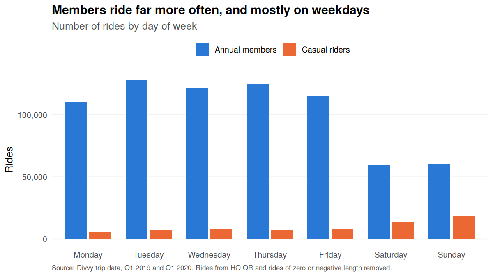
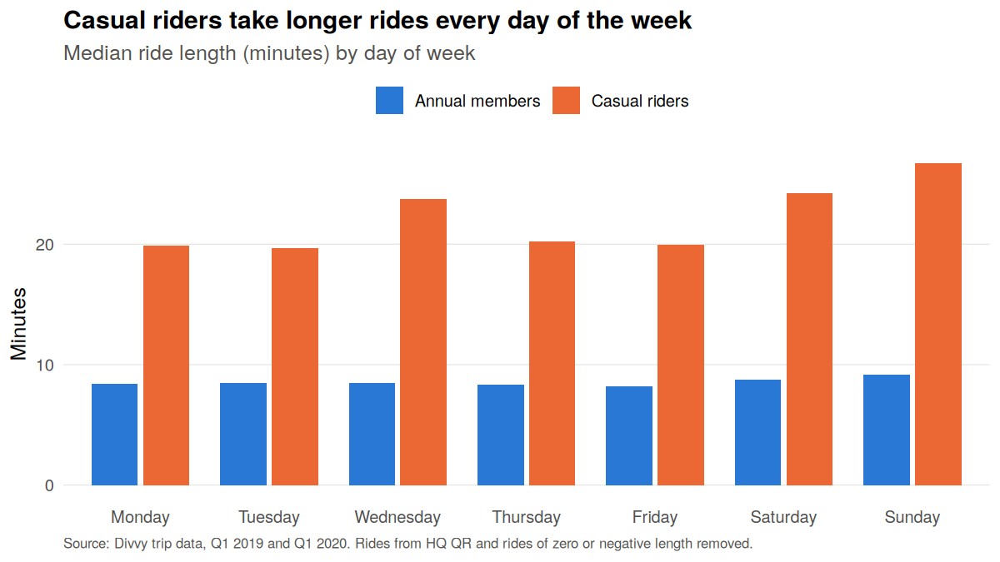
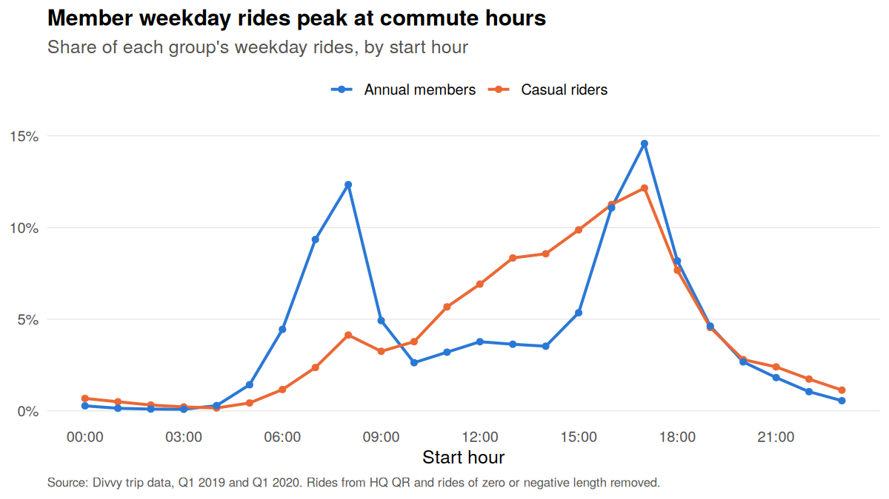
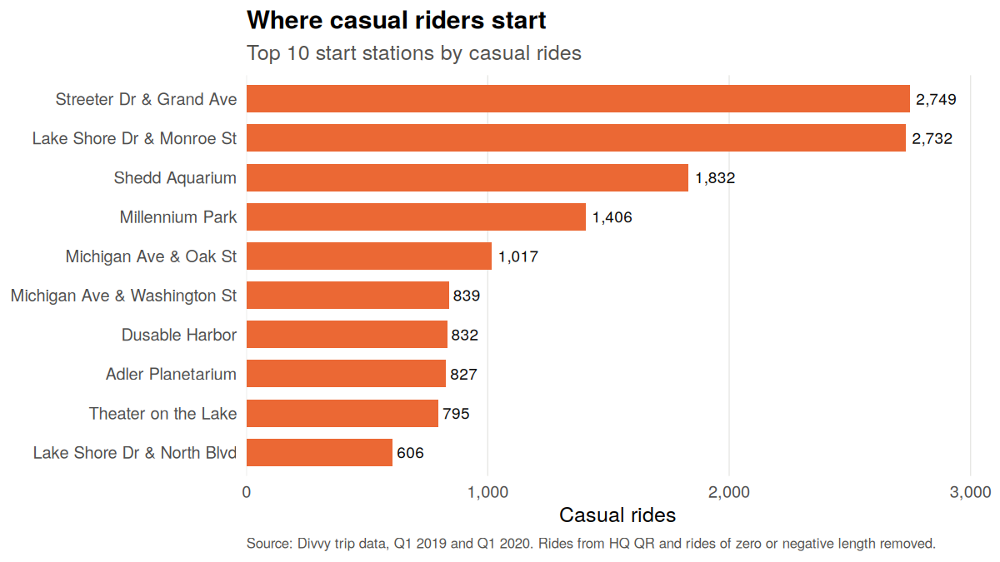

# Cyclistic Bike-Share Analysis

Google Data Analytics Certificate capstone case study. Cyclistic is a fictional bike-share company; the trip data are the real public **Divvy (Chicago) files for Q1 2019 and Q1 2020**. The question: how do annual members and casual riders use the bikes differently, and how can that guide a campaign to convert casual riders into members?

Every number and chart below is produced by [`analysis/cyclistic_analysis.R`](analysis/cyclistic_analysis.R).

## Key findings

| Measure | Annual members | Casual riders |
|---|---:|---:|
| Rides | 720,312 | 67,877 |
| Share of rides | 91.4% | 8.6% |
| Median ride length | 8.5 min | 23.2 min |
| Mean ride length | 13.3 min | 89.5 min |
| Share of all ride time | 61.1% | 38.9% |
| Share of own rides on weekends | 16.6% | 47.3% |

- **Members commute.** Their rides cluster Tuesday to Thursday, and weekday rides peak at 8 AM and 5 PM.
- **Casual riders ride for leisure.** Sunday and Saturday are their busiest days, their rides are longer on every day of the week, and their top start stations are lakefront and attraction sites (Streeter Dr & Grand Ave, Lake Shore Dr & Monroe St, Shedd Aquarium).
- **Casual riding grew.** Casual rides rose from 23,163 in Q1 2019 to 44,714 in Q1 2020; member rides rose from 341,906 to 378,406.






## Recommendations

1. **Lead with leisure, not commuting.** Pitch membership around weekend and longer leisure rides.
2. **Market where casual riders start.** Put membership offers on dock screens and in the app at the top casual start stations.
3. **Time it to the season.** Q1 is winter; confirm when casual riding peaks with full-year data before scheduling spend.

## Data and cleaning

- Source: [Divvy trip data](https://divvy-tripdata.s3.amazonaws.com/index.html), provided by Motivate International Inc. under the [Divvy Data License Agreement](https://divvybikes.com/data-license-agreement).
- 2019 columns renamed to the 2020 schema; Subscriber/Customer recoded to member/casual; both quarters combined (791,956 trips).
- Ride length calculated in Chicago time, so the March daylight-saving change doesn't distort durations.
- 3,767 rides that start at HQ QR (bikes taken out of service for quality checks) removed. That also removes every zero or negative ride length. 788,189 rides analysed. See [`outputs/cleaning_log.csv`](outputs/cleaning_log.csv).

## Limits

- Two winter quarters only; summer patterns may differ.
- No rider IDs, so repeat casual riders can't be identified.
- No pricing data, so membership savings can't be quantified.

## Run it

Requires R with `dplyr` and `ggplot2`. From the repository root:

```r
source("analysis/cyclistic_analysis.R")
```

The script downloads the two Divvy zip files into `data/` if they're missing, then writes tables to `outputs/` and charts to `outputs/charts/`.

## Files

| File | Contents |
|---|---|
| `analysis/cyclistic_analysis.R` | Full pipeline: download, clean, summarise, chart |
| `outputs/*.csv` | Summary tables behind every figure |
| `outputs/charts/*.png` | Charts |
| `Cyclistic_Case_Study_Report.docx` | Written report |
| `Cyclistic_Case_Study_Presentation.pptx` | Slide deck (native, editable charts) |
| `Cyclistic_Case_Study_Summary.pdf` | One-page summary |

## Contact

**Chinua Eric Robinson** · [crobinson144@gmail.com](mailto:crobinson144@gmail.com) · [LinkedIn](https://www.linkedin.com/in/chinua-eric-robinson/) · [chinuaericrobinson.com](https://www.chinuaericrobinson.com)
